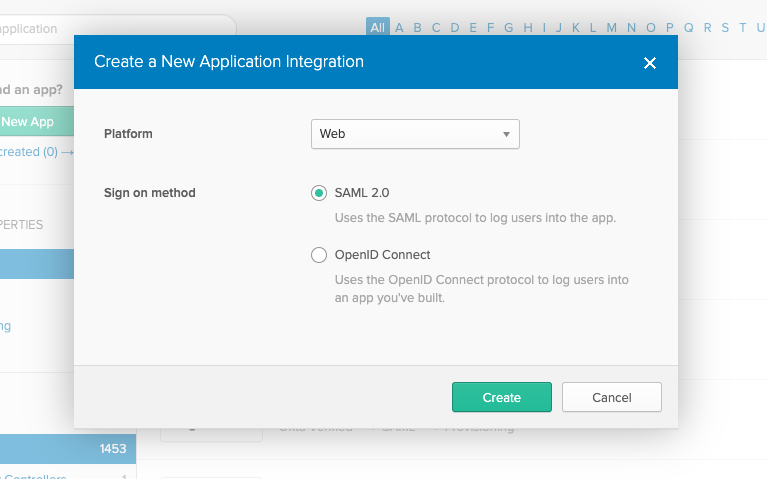
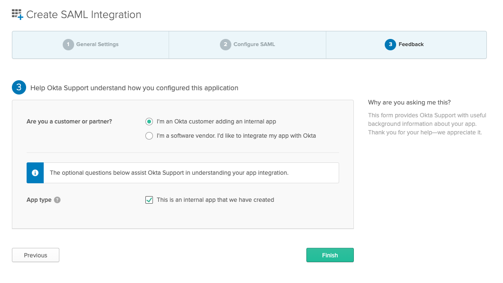

# Sagemaker GroundTruth Demo

## Instructions

The purpose of this demo is to show how one could initiate a flow from the Okta console and eventually get into Sagemaker GroundTruth. The high level steps are:
1. Upload images, create manifest
2. Create bare bones Cognito User Pool, SageMaker workteam
3. Create Okta SAML app and retrieve Okta app metadata URL
4. Update CloudFormation with Labeling Endpoint URL and Okta Metadata URL
5. Create Okta bookmark
6. Create job via CFN custom resource

<a name='upload-images' />

### Upload demo tennis images + Create/upload manifest

This first section is only necessary if you do not already have images and a manifest file. Effectively, it will just take the images folder, upload them to a bucket, create a manifest file, and upload that as well. SM GroundTruth will use the manifest file to create the actual labeling job later on.

1. Set up Python 3.7 working environment with virtualenv
First of all, to keep your laptop clean, I used virtualenv. Install it using pip or anything else you might like and create the venv:
```
$ cd awsdemos/sm-groundtruth/upload-images
$ virtualenv groundtruth-demo
$ source groundtruth-demo/bin/activate
```

2. Install pip requirements
The setup.py script has a number of requirements: boto, jsonlines, etc. First, install the dependencies:
```
$ pip install -r requirements.txt
```

3. Run setup to upload images and manifest
The python file currently has hard coded values for an S3 bucket and the path in lines 8 and 9. Feel free to change these but note that you will also need to update the custom resource index.py later.
```
$ python setup.py
```
<a name='launch-first-cfn-stack' />

### Create bare bones Cognito User Pool and Sagemaker Work Team
1. Launch CFN template core.yml
The template cfn/core.yml will serve as a base starting point. We will update this template later with a larger one. There is currently one parameter you have to put in - DefaultGroupName. It is the name of the work team you would like to create. In this case, I've named it English_default.

CLI:
```
$ aws cloudformation deploy --template-file cfn/core.yml --stack-name groundtruth-demo-core --parameter-override "DefaultGroupName=English_default" --capabilities CAPABILITY_IAM
```
You can do everything from the console as well. Once you create the stack, you should see 'CREATE_COMPLETE' on the [CloudFormation console](https://console.aws.amazon.com/cloudformation/).

Click on the '**Outputs**' tab and note down the values for **AudienceURI** and **SSODomain**


### Configure Okta
Here we will create an Okta SAML2 application. You have to use the old admin console UI in order to do this.

1. Log into Okta and go to the Admin console (**Admin** button on the top right).

2. On the top left, click **Developer Console** and choose **Classic UI**.


3. Click Applications, Add Application, Create New App
- **Platform**: Web
- **Sign on method**: SAML 2.0


4. General Settings
- **App Name:** <Enter an App Name>
- **Check "Do not display application icon to users"
- Check "Do not display application icon in the Okta Mobile App"**


5. SAML Settings
- **Single sign on URL:** *Enter value of CloudFormation Output SSODomain*
- **Audience URI (SP Entity ID)**: *Enter value of CloudFormation Output AudienceURI*
- **Name ID Format:** EmailAddress
- **Attribute Statements**
  - **Name:** http://schemas.xmlsoap.org/ws/2005/05/identity/claims/emailaddress
  - **Value:**  user.email


6. Feedback
Assuming this is just a demo, specify that you are using an internal app.
- **Are you a customer or a partner?**: I'm an Okta customer adding an internal app
- **App type**: This is an internal app that we have created


7. Copy the **Identity Provider metadata** link to put into Cognito.


8. Assign Users to your Okta group

<a name="getLabelingEndpoint" />

### Get Labeling endpoint
CloudFormation does not return the labeling endpoint from a workforce, so we will go to the AWS console and get the link. Without Okta, this is the link that annotators would go to by default to start labeling.

1. Go to the [Sagemaker console - Labeling workforces](https://us-west-2.console.aws.amazon.com/sagemaker/groundtruth?region=us-west-2#/labeling-workforces)
- Click on **Private**
- Copy **Labeling portal sign-in url**

### Update CFN
We will now update Cognito to use some new values and set up the SAML integration within Cognito. Take the labeling endpoint and pass it to CloudFormation as a parameter and also pass in the Okta metadata URL.

1. Update CloudFormation
The parameters in the CloudFormation template are **LabelingEndpoint** for the Label portal sign-in URL and **OktaMetadataURL** for the Identity Provider Metadata
```
$ aws cloudformation deploy --template-file cfn/core-updated.yml --stack-name groundtruth-demo-core --parameter-overrides "LabelingEndpoint=https://z182d0xam0.labeling.us-west-2.sagemaker.aws" "OktaMetadataURL=https://dev-642335.okta.com/app/exk5cgpnbeOAET1ho4x6/sso/saml/metadata" "DefaultGroupName=English_default" --capabilities CAPABILITY_IAM
```

Eventually, your stack should say **UPDATE_COMPLETE**

### Create Bookmark
Cognito does not currently supprt IdP initiated flows, so all flows must initiate from Cognito. Fortunately, we can build a URL such that when it's hit, it will initiate a flow to Okta, which will then authenticate and pass the right tokens back to Cognito to ultimately log you in. The URL is already built for you and is in the CloudFormation Outputs under **BookmarkURL**

1. Create Bookmark Application in Okta
- Add an application and search for **Bookmark**


**General Settings**
- **Application Label:** *Enter a name for the bookmark*
- **URL:** *Enter value of CloudFormation Output BookmarkURL*


2. Assign users to your bookmark.

<a name="create-gt-job" />

### Create GT Job
Now it's time to finally create a GroundTruth labeling job. We will use a CloudFormation custom resouce to create the GroundTruth labeling job. The custom resource will call a Lambda function to create a job on the fly when you create the CloudFormation stack.

1. Update Lambda function
The Lambda function takes a number of parameters from CloudFormation:
- WorkTeamArn
- SageMakerExecutionRole
- LabelAttributeName
- S3ManifestURI
- LabelingS3Bucket

Please make sure you edit these options by using --parameter override or modifying the CloudFormation template defaults. The CoreStackName parameter must be whatever your core stack name is as it will pull in the Work Team that was created initially.

In Line 52 of the Lambda function's index.py, there is a LabelJobUiTemplatePath that gets passed into the Labeling Job creation API later. This references a 'template.liquid' file that is in the sm-groundtruth/upload-images/annotation-tool folder within this repo. The template is the default one from AWS. Feel free to update. It does have to exist, and for the custom Lambda to work, it is expecting it in your S3 bucket/config path (Line 45)/annotation-tool/template.liquid.

2. Package Lambda function
I won't be going into detail about how to package a Lambda function, but the simplest way is to zip all the packages you need and the code like this:

```
$ pip install -r lambda/requirements.txt --target lambda/packages
# For Image Classification
$ cd lambda/
$ ./bundle-imgclass.sh
# For NER
$ cd lambda/
$ ./bundle-ner.sh
$ cd ..
```

- Then deploy it:
```
$ aws cloudformation deploy --template-file cfn/createjob-imgclass.yml --stack-name groundtruth-demo-job-imgclass --capabilities CAPABILITY_IAM
$ aws cloudformation deploy --template-file cfn/createjob-ner.yml --stack-name groundtruth-demo-job-ner --capabilities CAPABILITY_IAM
```

### Test Access
- Go to Okta in new incognito tab - You will get session errors otherwise.
- Click bookmark

## Flow if you dont need Okta

1. Upload Images
Same step as the Okta flow for [uploading images](#upload-images)

2. Deploy bare Cognito stack
Same steps as [Create bare bones Cognito User Pool and Sagemaker Work Team](#launch-first-cfn-stack)
```
$ aws cloudformation deploy --template-file cfn/core.yml --stack-name groundtruth-demo-core --parameter-override "DefaultGroupName=English_default" --capabilities CAPABILITY_IAM
```

3. Deploy Updated stack with Labeling Endpoint
Skip all the Okta stuff and make sure you use the core-nookta.yml file.
See [Get Labeling endpoint](#getLabelingEndpoint)
```
$ aws cloudformation deploy --template-file cfn/core-nookta.yml --stack-name groundtruth-demo-core --parameter-overrides "LabelingEndpoint=https://z182d0xam0.labeling.us-west-2.sagemaker.aws" "DefaultGroupName=English_default" --capabilities CAPABILITY_IAM
```

4. Deploy Labeling Job
See [Create GT Job](#create-gt-job)

```
$ aws cloudformation deploy --template-file cfn/createjob-cfn.yml --stack-name groundtruth-demo-job-6 --capabilities CAPABILITY_IAM
```
